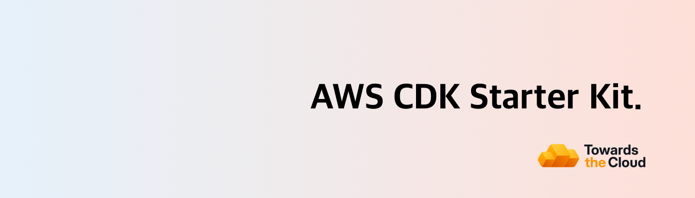

# 

# AWS CDK Starter Kit

Production-ready AWS CDK TypeScript starter kit with secure OIDC authentication, automated CI/CD, and branch-based deployments. Deploy infrastructure to AWS in minutes with projen-powered configuration.

<!-- TIP-LIST:START -->
> [!TIP]
> **Towards the Cloud runs the AWS foundation for modern product teams. This means your team ships faster, slashes AWS spend, and stay audit-ready without having to hire a platform squad.**
>
> Unsure where to start? Book a free AWS Account Review. We’ll analyse your AWS environment, hand you a security & cost report, and you decide whether to act on it yourself or have us execute. No pressure, no retainer required up front.
>
> 
>
> 

> 
☁️ <strong>See how we turn AWS chaos into a compliant, cost-efficient platform…</strong>

>  
>
> ### The problem: AWS complexity compounds fast
>
> Ad‑hoc builds become 40–60% overspend, unmonitored security gaps put customer data at risk, and engineers burn out running infrastructure instead of shipping products.
>
> ### Our managed foundation keeps you moving forward
>
> - ✅ **Compliant Landing Zone** – [Multi-account AWS CDK deployment](https://towardsthecloud.com/services/aws-landing-zone) with 100% [CIS benchmark](https://docs.aws.amazon.com/securityhub/latest/userguide/cis-aws-foundations-benchmark.html) coverage,
> centralized logging, and SSO-ready access control.
> - ✅ **Production-ready CDK components** – Pre-hardened building blocks so teams launch new services without reinventing best practices.
> - ✅ **CI/CD with safe rollbacks** – GitOps workflows and governed pipelines that let you release faster with confidence.
> - ✅ **Quarterly cost & security reviews** – [Cost Optimisation](https://towardsthecloud.com/services/aws-cost-optimization) plus [Security Reviews](https://towardsthecloud.com/services/aws-security-review)
> delivered proactively.
> - ✅ **Fractional Cloud Engineer** – On-demand expertise from an architect who implemented enterprise-grade AWS infrastructure for over a decade.
>
> ### Outcomes our customers see
>
> - **30%+ lower AWS bill** – Continuous oversight prevents expensive drift ([30–60% documented savings](https://towardsthecloud.com/services/aws-cost-optimization#case-study)).
> - **SOC 2 / HIPAA acceleration** – Guardrails, logging, and evidence packs ready on day one.
> - **Audit-ready every quarter** – Automated monitoring plus recurring reviews keep findings under control.
> - **Faster product velocity** – Engineers build features, not managing infrastructure.
> - **Headcount leverage** – A [flexible retainer](https://towardsthecloud.com/pricing) replaces the cost of a full-time platform team.
>
> **Proof:** Y Combinator startup Accolade used our Landing Zone to [earn SOC 2 in record time](https://towardsthecloud.com/blog/aws-landing-zone-case-study-accolade):
>
> *“We achieved a perfect security score in days, not months.”* — Galen Simmons, CEO
>
> Ready to see where your AWS account stands? Grab a spot while they’re available:
>
> 
>
> 

<!-- TIP-LIST:END -->

## 🚀 Features

- **⚡ Rapid Setup**: Jumpstart your project within minutes by tweaking a [single configuration file (projen)](./.projenrc.ts)
  - Preconfigured TypeScript with optimized compiler settings in [tsconfig.json](./tsconfig.json)
  - Pre-configured linting & formatting with [biome.jsonc](./biome.jsonc) for code quality
  - Clean [project structure](#project-structure) for easy management of constructs and stacks
- **🛡️ Seamless Security**: OIDC authentication for keyless AWS deployments - no stored credentials or long-lived secrets required
- **🤖 Automated CI/CD**: Out-of-the-box GitHub Actions workflows with multi-account support for enterprise-ready deployments
- **💬 Automated CDK Diff on PRs**: [CDK diff outputs](https://github.com/marketplace/actions/aws-cdk-diff-pr-commenter) are automatically posted to your pull requests for easy infrastructure change reviews
- **💻 Branch-based Deployments**: Deploy multiple CDK stacks to the same AWS environments based on Git branch for an improved multi-developer workflow
- **📦 Automated Dependency Management**: Dependabot creates grouped PRs with auto-approval for passing checks, streamlining updates while maintaining stability

## Quick Start

This project requires at least **Node.js version 22**.

**To get started, follow these steps:**

1. Click the green ["Use this template"](https://github.com/new?template_name=aws-cdk-starter-kit&template_owner=towardsthecloud) button to create a new repository based on this starter kit.

2. Install the project dependencies using: `npm ci`

3. Customize the AWS Region and Account IDs in the [.projenrc.ts](./.projenrc.ts) file to match your AWS setup.

4. Run `npx projen` to generate the GitHub Actions workflow files.

5. Ensure you're logged into an AWS Account via the AWS CLI.

6. Deploy the CDK toolkit stack with `cdk bootstrap` if it's not already set up.

7. Deploy the GitHub OIDC Stack to enable GitHub Actions workflow permissions for AWS deployments.

8. Commit and push your changes to the `main` branch to trigger the CDK deploy pipeline in GitHub.

Congratulations! You've successfully set up your project.

## 📚 Full Documentation

For detailed setup instructions, architecture explanations, and advanced usage guides, visit the **[→ official documentation](https://towardsthecloud.com/docs/aws-cdk-starter-kit)**.
## Acknowledgements

A heartfelt thank you to the creators of [projen](https://github.com/projen/projen). This starter kit stands on the shoulders of giants, made possible by their pioneering work in simplifying cloud infrastructure projects!

## Author

[Danny Steenman](https://towardsthecloud.com/about)

