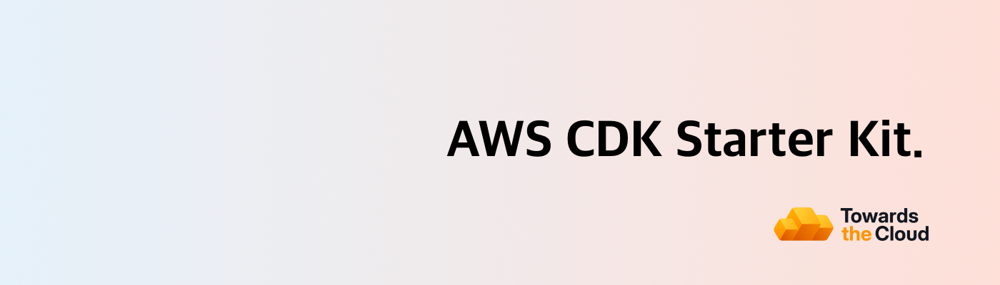

# [](https://towardsthecloud.com)

# AWS CDK Starter Kit

[](https://github.com/towardsthecloud/aws-cdk-starter-kit/actions/workflows/build.yml)
[](https://biomejs.dev)
[](https://github.com/towardsthecloud/aws-cdk-starter-kit/releases)

Welcome to the starting line of your next AWS CDK project. This repository is crafted to supercharge your project's setup with AWS CDK TypeScript, projen, and GitHub actions, ensuring a smooth and efficient deployment to your AWS account.

<!-- TIP-LIST:START -->
> [!TIP]
> **Towards the Cloud runs the AWS foundation for modern product teams. This means your team ships faster, slashes AWS spend, and stay audit-ready without having to hire a platform squad.**
>
> Unsure where to start? Book a free AWS Account Review. We’ll analyse your AWS environment, hand you a security & cost report, and you decide whether to act on it yourself or have us execute. No pressure, no retainer required up front.
>
> <a href="https://cal.com/towardsthecloud/aws-account-review"></a>
>
> <details>
> <summary>☁️ <strong>See how we turn AWS chaos into a compliant, cost-efficient platform…</strong></summary>
> <br/>
>
> ### The problem: AWS complexity compounds fast
>
> Ad‑hoc builds become 40–60% overspend, unmonitored security gaps put customer data at risk, and engineers burn out running infrastructure instead of shipping products.
>
> ### Our managed foundation keeps you moving forward
>
> - ✅ **Compliant Landing Zone** – [Multi-account AWS CDK deployment](https://towardsthecloud.com/services/aws-landing-zone) with 100% [CIS benchmark](https://docs.aws.amazon.com/securityhub/latest/userguide/cis-aws-foundations-benchmark.html) coverage,
> centralized logging, and SSO-ready access control.
> - ✅ **Production-ready CDK components** – Pre-hardened building blocks so teams launch new services without reinventing best practices.
> - ✅ **CI/CD with safe rollbacks** – GitOps workflows and governed pipelines that let you release faster with confidence.
> - ✅ **Quarterly cost & security reviews** – [Cost Optimisation](https://towardsthecloud.com/services/aws-cost-optimization) plus [Security Reviews](https://towardsthecloud.com/services/aws-security-review)
> delivered proactively.
> - ✅ **Fractional Cloud Engineer** – On-demand expertise from an architect who implemented enterprise-grade AWS infrastructure for over a decade.
>
> ### Outcomes our customers see
>
> - **30%+ lower AWS bill** – Continuous oversight prevents expensive drift ([30–60% documented savings](https://towardsthecloud.com/services/aws-cost-optimization#case-study)).
> - **SOC 2 / HIPAA acceleration** – Guardrails, logging, and evidence packs ready on day one.
> - **Audit-ready every quarter** – Automated monitoring plus recurring reviews keep findings under control.
> - **Faster product velocity** – Engineers build features, not managing infrastructure.
> - **Headcount leverage** – A [flexible retainer](https://towardsthecloud.com/pricing) replaces the cost of a full-time platform team.
>
> **Proof:** Y Combinator startup Accolade used our Landing Zone to [earn SOC 2 in record time](https://towardsthecloud.com/blog/aws-landing-zone-case-study-accolade):
>
> *“We achieved a perfect security score in days, not months.”* — Galen Simmons, CEO
>
> Ready to see where your AWS account stands? Grab a spot while they’re available:
>
> <a href="https://cal.com/towardsthecloud/aws-account-review"></a>
>
> </details>
<!-- TIP-LIST:END -->

## 🚀 Features

- **⚡ Rapid Setup**: Jumpstart your project within minutes by tweaking a [single configuration file (projen)](./.projenrc.ts)
  - Preconfigured TypeScript with optimized compiler settings in [tsconfig.json](./tsconfig.json)
  - Pre-configured linting & formatting with [biome.jsonc](./biome.jsonc) for code quality
  - Clean [project structure](#project-structure) for easy management of constructs and stacks
- **🛡️ Seamless Security**: OIDC authentication for keyless AWS deployments - no stored credentials or long-lived secrets required
- **🤖 Automated CI/CD**: Out-of-the-box GitHub Actions workflows with multi-account support for enterprise-ready deployments
- **💬 Automated CDK Diff on PRs**: [CDK diff outputs](https://github.com/marketplace/actions/aws-cdk-diff-pr-commenter) are automatically posted to your pull requests for easy infrastructure change reviews
- **💻 Branch-based Deployments**: Deploy multiple CDK stacks to the same AWS environments based on Git branch for an improved multi-developer workflow
- **📦 Automated Dependency Management**: Dependabot creates grouped PRs with auto-approval for passing checks, streamlining updates while maintaining stability

## Setup Guide

> [!NOTE]
> Looking for the full setup guide? Visit the detailed documentation at [towardsthecloud.com/docs/aws-cdk-starter-kit](https://towardsthecloud.com/docs/aws-cdk-starter-kit).

This project requires a atleast **Node.js version 22**.

All the config that is needed to personalise the CDK App to your environment is defined in the [.projenrc.ts file](./.projenrc.ts).

**To get started, follow these steps:**

1. Click the green ["Use this template"](https://github.com/new?template_name=aws-cdk-starter-kit&template_owner=towardsthecloud) button to create a new repository based on this starter kit.

2. Add a Personal Access Token to the repository settings on GitHub, follow these [instructions for setting up a fine-grained personal access token](https://projen.io/docs/integrations/github/#fine-grained-personal-access-token-beta).

3. Install the projects dependencies using: `npm ci`

4. Customize the AWS Region and Account IDs in the [.projenrc.ts](./.projenrc.ts) file to match your AWS setup:

```typescript
/* Define the AWS region for the CDK app and github workflows
Default to us-east-1 if AWS_REGION is not set in your environment variables */
const awsRegion = process.env.AWS_REGION || 'us-east-1';

// Define the target AWS accounts for the different environments
type Environment = 'test' | 'production';

interface EnvironmentConfig {
  accountId: string;
  enableBranchDeploy: boolean;
}

const environmentConfigs: Record<Environment, EnvironmentConfig> = {
  test: { accountId: '987654321012', enableBranchDeploy: true },
  production: { accountId: '123456789012', enableBranchDeploy: false },
};
```

5. Run `npx projen` to generate the github actions workflow files.

6. AWS CLI Authentication: Ensure you're logged into an AWS Account (one of the ones you configured in step 4) via the AWS CLI. If you haven't set up the AWS CLI, [then follow this guide](https://towardsthecloud.com/set-up-aws-cli-aws-sso))

7. Deploy the CDK toolkit stack to your AWS environment with `cdk bootstrap` if it's not already set up.

8. Deploy the GitHub OIDC Stack to enable GitHub Actions workflow permissions for AWS deployments. For instance, if you set up a `dev` environment, execute `npm run dev:deploy`.

9. Commit and push your changes to the `main` branch to trigger the CDK deploy pipeline in GitHub.

Congratulations 🎉! You've successfully set up your project.

## Project Structure

When working on smaller projects using infrastructure as code, where you deploy single applications that don't demand extensive maintenance or collaboration from multiple teams, it's recommended to structure your AWS CDK project in a way that enables you to deploy both the application and infrastructure using a single stack.

However, as projects evolve to encompass multiple microservices and a variety of stateful resources (e.g., databases), the complexity inherently increases.

In such cases, adopting a more sophisticated AWS CDK project organization becomes critical. This ensures not only the ease of extensibility but also the smooth deployment of each component, thereby supporting a more robust development lifecycle and facilitating greater operational efficiency.

To cater to these advanced needs, your AWS CDK project should adopt a modular structure. This is where the **AWS CDK Starter Kit** shines ✨.

Here's a closer look at how this structure enhances maintainability and scalability:

```bash
.
├── cdk.context.json
├── cdk.json
├── LICENSE
├── package-lock.json
├── package.json
├── README.md
├── src
│   ├── assets
│   │   ├── ecs
│   │   │   └── example-container
│   │   └── lambda
│   │       └── example-lambda-function
│   ├── bin
│   │   ├── cicd-helper.ts
│   │   ├── env-helper.ts
│   │   └── git-helper.ts
│   ├── constructs
│   │   ├── base-construct.ts
│   │   ├── index.ts
│   │   ├── network-construct.ts
│   │   └── README.md
│   ├── main.ts
│   └── stacks
│       ├── foundation-stack.ts
│       ├── index.ts
│       ├── README.md
│       └── starter-stack.ts
├── test
│   ├── __snapshots__
│   │   └── main.test.ts.snap
│   └── main.test.ts
├── tsconfig.dev.json
└── tsconfig.json
```

As you can see in the above tree diagram, the way this project is setup it tries to segment it into logical units, such as **constructs** for reusable infrastructure patterns, **stacks** for deploying groups of resources and **assets** for managing source code of containers and lambda functions.

Here is a brief explanation of what each section does:

- `src/assets`: Organizes the assets for your Lambda functions and ECS services, ensuring that the application code is neatly encapsulated with the infrastructure code.
- `src/bin`: Contains utility scripts (e.g., `cicd-helper.ts`, `env-helper.ts`, `git-helper.ts`) that streamline environment setup and integration with CI/CD pipelines.
- `src/constructs`: Houses the core building blocks of your infrastructure. These constructs can be composed into higher-level abstractions, promoting reusability across different parts of your infrastructure. Check out the [README in the constructs folder](./src/constructs/README.md) to read how you can utilize environment-aware configurations.
- `src/stacks`: Dedicated to defining stacks that represent collections of AWS resources (constructs). This allows for logical grouping of related resources, making it simpler to manage deployments and resource dependencies. Check out the [README in the stacks folder](./src/stacks/README.md) to read how you can instantiate new stacks.
- `src/lib/main.ts`: This is where the CDK app is instantiated.
- `test`: Is the location to store your unit or integration tests (powered by jest)

## Branch-based Deployments (Ephemeral Environments)

This starter kit supports deploying multiple CDK stacks to the same AWS environments based on the Git branch. This enables you to easily test changes when multiple developers work on the same code base.

When you create a new feature branch and push it to the repository, the GitHub Actions workflow will automatically deploy the CDK stacks to the corresponding AWS environment (e.g., dev, test, staging) based on the branch name.

Additionally, the workflow includes a separate task to destroy the CDK stacks for the feature branch when the branch is deleted or the pull request is closed, ensuring that the resources are cleaned up after the testing is complete.

## AWS CDK Starter Kit for Python Users

> **Looking for the Python version of this AWS CDK starter kit?** Check out the [AWS CDK Python Starter Kit](https://github.com/towardsthecloud/aws-cdk-python-starter-kit) for a tailored experience that leverages the full power of AWS CDK with Python.

## Acknowledgements

A heartfelt thank you to the creators of [projen](https://github.com/projen/projen). This starter kit stands on the shoulders of giants, made possible by their pioneering work in simplifying cloud infrastructure projects!

## Author

[Danny Steenman](https://towardsthecloud.com/about)

[](https://www.linkedin.com/company/towardsthecloud)
[](https://twitter.com/dannysteenman)
[](https://github.com/towardsthecloud)
