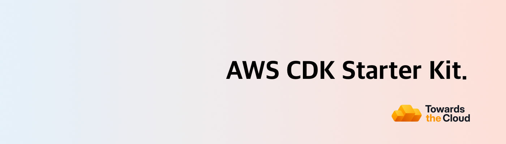

# [](https://towardsthecloud.com)

## AWS CDK Starter Kit

[](https://github.com/towardsthecloud/aws-cdk-starter-kit/actions/workflows/build.yml)
[](https://biomejs.dev)
[](https://github.com/towardsthecloud/aws-cdk-starter-kit/releases)

Production-ready AWS CDK TypeScript starter kit with secure OIDC authentication, automated CI/CD, and branch-based deployments. Deploy infrastructure to AWS in minutes with projen-powered configuration.

### 🚀 Features

- **⚡ Rapid Setup**: Jumpstart your project within minutes by tweaking a [single configuration file (projen)](./.projenrc.ts)
  - Preconfigured TypeScript with optimized compiler settings in [tsconfig.json](./tsconfig.json)
  - Pre-configured linting & formatting with [biome.jsonc](./biome.jsonc) for code quality
  - Clean [project structure](#project-structure) for easy management of constructs and stacks
- **🛡️ Seamless Security**: OIDC authentication for keyless AWS deployments - no stored credentials or long-lived secrets required
- **🤖 Automated CI/CD**: Out-of-the-box GitHub Actions workflows with multi-account support for enterprise-ready deployments
- **💬 Automated CDK Diff on PRs**: [CDK diff outputs](https://github.com/marketplace/actions/aws-cdk-diff-pr-commenter) are automatically posted to your pull requests for easy infrastructure change reviews
- **💻 Branch-based Deployments**: Deploy multiple CDK stacks to the same AWS environments based on Git branch for an improved multi-developer workflow. Ephemeral environment deploys and destroys use CDK express mode, so they can run [up to 4x faster than normal deploys](https://aws.amazon.com/about-aws/whats-new/2026/06/aws-cloudformation-cdk/). Enable **"Automatically delete head branches"** in your repo settings so merged branch stacks are cleaned up automatically via the destroy workflow
- **📦 Automated Dependency Management**: projen's `depsUpgrade` workflow opens dependency upgrade PRs, with Mergify handling approved PRs after passing checks

<!-- TIP-LIST:START -->
> [!TIP]
> **We eliminate AWS complexity so you ship faster, spend less, and stay compliant.**
>
> Our managed AWS service gives you three things: a production-grade AWS CDK Landing Zone with built-in compliance controls, proactive monitoring that stops cost waste and security drift, and senior AWS expertise that speeds up your team's delivery.
>
> Book a free demo to see where you stand and what we'd fix first:
>
> <a href="https://towardsthecloud.com/services/aws-cdk-landing-zone#cta"></a>
>
> <details>
> <summary>⚡ <strong>See the symptoms of a missing AWS foundation and how we solve them</strong></summary>
> <br/>
>
> AWS starts simple. Then you scale: production and staging blur together, resources multiply without owners, IAM policies accumulate exceptions, security findings pile up in backlogs, and the bill climbs month after month.
>
> Those are symptoms of a missing AWS foundation. Without one, your developers spend more time fixing problems than shipping features.
>
> **We provide that foundation and own it entirely, so your team focuses on shipping, not firefighting.**
>
> ### Here's what's included:
>
> **1. We Provision a Secure [AWS CDK Landing Zone](https://towardsthecloud.com/services/aws-cdk-landing-zone) That Accelerates Compliance**
> - Multi-account architecture with security controls and compliance guardrails from day one
> - Scores 100% on the [CIS AWS Foundations Benchmark](https://docs.aws.amazon.com/securityhub/latest/userguide/cis-aws-foundations-benchmark.html) and 96% on [AWS Foundational Security Best Practices](https://docs.aws.amazon.com/securityhub/latest/userguide/fsbp-standard.html)
> - Those benchmarks map straight to **SOC 2**, **HIPAA**, and **PCI-DSS** controls, cutting months from your compliance timeline
>
> **2. We Monitor Proactively to Stop Cost Waste and Security Drift**
> - Quarterly cost reviews catch unattached volumes, oversized instances, and orphaned resources before they compound. AWS spend drops 20-30% on average, with [outliers hitting 60+%](https://towardsthecloud.com/services/aws-cost-optimization#case-study)
> - Continuous security monitoring across all accounts catches misconfigurations immediately. You get alerts while issues are still fixable, not after they're breaches
>
> **3. We Provide Senior AWS Expertise That Speeds Up Delivery**
> - Your developers get production-ready IaC templates for common patterns: multi-AZ applications, event-driven architectures, secure data pipelines. What takes weeks of research ships in hours
> - Architecture guidance on VPC design, IAM policies, disaster recovery, and observability from engineers who've solved these problems at enterprise scale
>
> [*"We achieved a perfect security score in days, not months."*](https://towardsthecloud.com/blog/case-study-accolade)
> *Galen Simmons, CEO of Accolade (Y Combinator startup)*
>
> </details>
<!-- TIP-LIST:END -->

### Quick Start

This project requires at least **Node.js version 22**.

**To get started, follow these steps:**

1. Click the green ["Use this template"](https://github.com/new?template_name=aws-cdk-starter-kit&template_owner=towardsthecloud) button to create a new repository based on this starter kit.

2. Install the project dependencies using: `pnpm install --frozen-lockfile`

3. Customize the AWS Region and Account IDs in the [.projenrc.ts](./.projenrc.ts) file to match your AWS setup.

4. Run `npx projen` to generate the GitHub Actions workflow files.

   The generated dependency upgrade workflow's "Create Pull Request" step uses [`PROJEN_GITHUB_TOKEN`](https://projen.io/docs/integrations/github/), so add that repository secret if you want scheduled projen dependency update PRs.

5. Ensure you're logged into an AWS Account via the AWS CLI.

6. Deploy the CDK toolkit stack with `cdk bootstrap` if it's not already set up.

7. Deploy the GitHub OIDC Stack to enable GitHub Actions workflow permissions for AWS deployments.

   Local synth resolves your repository's numeric GitHub IDs through `gh api`, so run `gh auth login` first.

8. Opt the repository into immutable OIDC subject claims:

   ```bash
   gh api -X PUT repos/OWNER/REPOSITORY/actions/oidc/customization/sub -F use_default=true -F use_immutable_subject=true
   ```

   The deploy role only trusts the immutable claim, so do this after step 7. See [`src/stacks/README.md`](./src/stacks/README.md#github-immutable-oidc-subjects).

9. Commit and push your changes to the `main` branch to trigger the CDK deploy pipeline in GitHub.

Congratulations! You've successfully set up your project.

### 📚 Full Documentation

For detailed setup instructions, architecture explanations, and advanced usage guides, visit the **[→ official documentation](https://towardsthecloud.com/docs/aws-cdk-starter-kit)**.

### Acknowledgements

A heartfelt thank you to the creators of [projen](https://github.com/projen/projen). This starter kit stands on the shoulders of giants, made possible by their pioneering work in simplifying cloud infrastructure projects!

### Author

[Danny Steenman](https://towardsthecloud.com/about)

[](https://www.linkedin.com/company/towardsthecloud)
[](https://twitter.com/dannysteenman)
[](https://github.com/towardsthecloud)
